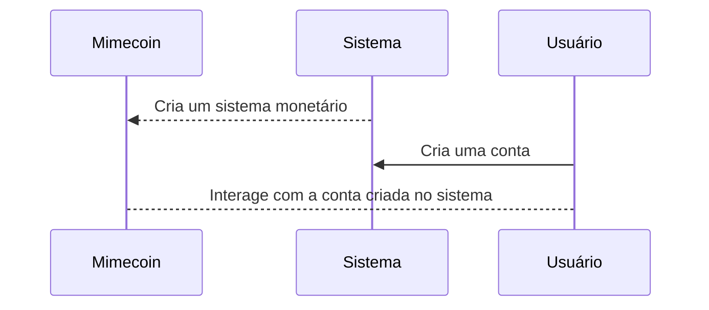

# Conceito base
Uma plataforma de *Token as a Service* onde o usuário pode criar seu próprio sistema monetário no formato whitelabel permitindo a criação de um sistema *bank-like* que envolve tokens fictícios. O serviço basico envolve a criação do sistema monetário via dashboard, a geração de chaves de API e então o uso do serviço via API.

Temos 3 atores principais nesse conceito:

 - **Mimecoin**: que age como uma entidade reguladora de todos os sistemas criados
 - **Sistema**: que é a entidade que consome o mimecoin
 - **Usuário**: que tem sua conta dentro de algum sistema



## Interações

### Gestão usuário do sistema

| Ação | Interface | Admin | Usuário | Notas
| -- | :--: | :--: | :--: | :-- | 
| Cadastro | web | ➖ | ✔️ | Acesso público
| Editar informações | web | ➖ | ✔️ | Para o usuário logado
||
| Criar sistema monetário | web | ➖ | ✔️ | Para o usuário logado, limitado a 1 sistema por usuário inicialmente
| Editar sistema monetário | web | ➖ | ✔️ | 
| Consultar oferta atual do sistema | web | ➖ | ✔️ | 
||
| Listar chaves de acesso | web | ➖ | ✔️ |
| Gerar chave de acesso | web | ➖ | ✔️ | A chave é usada para autenticar via API
| Remover chave de acesso | web | ➖ | ✔️ | 
||
| Definir limite de sistemas monetários | web | ✔️ | ❌ | Define o limite de sistemas que um usuário pode criar |
| Definir oferta máxima de sistema | web | ✔️ | ❌ | A oferta se refere ao máximo de moeda que o sistema pode circular. O padrão é 10 mil. |
| Definir precisão decimal | web | ✔️ | ❌ | Usar 2 opções: 0 onde o token não pode ser fracionado; e 2 para tokens monetários. |
||
| Criar conta | api | ❌ | ✔️ | Para o sistema monetário da chave de acesso |
| Editar conta no sistema | api | ❌ | ✔️ | No sistema monetário da chave de acesso |
| Bloquear conta no sistema  | api | ❌ | ✔️ | No sistema monetário da chave de acesso |
||
| Depositar saldo em conta  | api | ❌ | ✔️ | No sistema monetário da chave de acesso |
| Depositar saldo de bonus | api | ❌ | ✔️ | No sistema monetário da chave de acesso |
||
| Editar informações | api | ❌ | ✔️ | Quando logado com uma conta do sistema
| Ver saldo | api | ❌ | ✔️ | Quando logado com uma conta do sistema
| Ver extrato | api | ❌ | ✔️ | Quando logado com uma conta do sistema
| Fazer depósito | api | ❌ | ✔️ | Quando logado com uma conta do sistema
| Fazer transferencia | api | ❌ | ✔️ | Quando logado com uma conta do sistema
| Fazer pagemento | api | ❌ | ✔️ | Quando logado com uma conta do sistema
| Gerar cobrança | api | ❌ | ✔️ | Quando logado com uma conta do sistema
| Configurar pin de segurança | api | ❌ | ✔️ | Quando logado com uma conta do sistema

## Autenticação

As ações que envolvem conta de um usuário as requisições preciam atender aos requisitos abaixo.

```
    // No header da requisição
    {
        "account": "número da conta",
        "bank": "código do sistema monetário",
        "expiresAt": "",
    }

    // No body da requisição
    {
        ...,
        "signature" : SHA( JSON.stringfy( req.body ) + { NÚMERO DA CONTA } + { PIN DO USUÀRIO } )
    }
```

## Estrutura dos dados

Cada conta criada é composta por 3 dados principais:
```[ Código do sistema monetário ] 0001 [ Número da conta ] [ Dígito verificador ]```

O Código do sistema monetário funciona como o código do banco, o 0001 é a agencia, no caso ela é sempre 0001.
O dígito verificador é calculado com base no algoritmo MOD11 onde os dígitos são dispostos numa unica linha e cada valor é individualmente multiplicado por um fator, todos os valores são somados e resto da divisão dele por 11 é o dígito verificador da conta.

```
	A = Digitos do código do sistema monetário
	B = Digitos da conta

	[ A1 A2 A3 ] [  0  0  0  1  ] [ B1 B2 B3 B4 B5 ]

	A1 * 13
	A2 * 12
	A3 * 11

	0 * 10
	0 * 9
	0 * 8
	1 * 7

	B1 * 6
	B2 * 5
	B3 * 4
	B4 * 3
	B5 * 2

	Resultado % 11 = DV
```

## Erros previstos

```
    [
        {
            code: 401,
            message: "Token de sistema de acesso inválido."
        },
        {
            code: 403,
            message: "Token de sistema de acesso sem permissão."
        },
        {
            code: 701,
            message: "Usuário não tem um pin cadastrado"
        },
        {
            code: 702,
            message: "Assinatura não reconhecida",
        },
    ]
```
